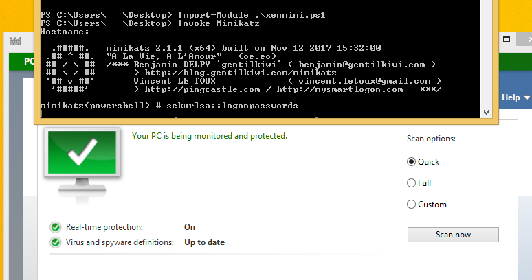
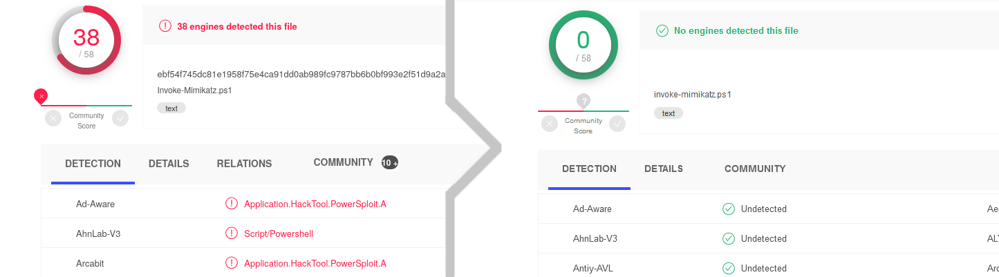

# Xencrypt
### PowerShell crypter v 1.0

## Authors

Xentropy ( [@SamuelAnttila](http://twitter.com/SamuelAnttila) )  
SecForce ( [@SECFORCE_LTD](http://twitter.com/SECFORCE_LTD) )

If you want to read about the design behind this tool and how to make your own crypter, there's an article I wrote about it here: [Write a crypter in any language](https://netsec.expert/2020/02/06/write-a-crypter-in-any-language.html)

## Note

Don't be a script kiddie, I made this GPLv3 so you can make your own modifications. This tool is intended as a demo for how easy it is to write your own crypter. It works for its intended purpose and I will not patch it to make it suitable for yours. 

## In action


## Features
Xencrypt:
* Bypasses AMSI and all modern AVs in use on VirusTotal (as of writing)
* Compresses and encrypts powershell scripts
* Has a minimal and often even negative (thanks to the compression) overhead
* Randomizes variable names to further obfuscate the decrypter stub
* Randomizes encryption, compression and even the order that the statements appear in the code for maximum entropy!
* Super easy to modify to create your own crypter variant
* Supports recursive layering (crypter crypting the crypted output), tested up to 500 layers.
* Supports Import-Module as well as standard running as long as the input script also supported it
* GPLv3 -- Free and open-source!
* All features in a single file so you can take it with you anywhere!
* Is despite all of the above not a silver bullet for every configuration -- caveat emptor!

## Usage
```
Import-Module ./xencrypt.ps1
Invoke-Xencrypt -InFile invoke-mimikatz.ps1 -OutFile xenmimi.ps1
```
You will now have an encrypted xenmimi.ps1 file in your current working directory. You can use it in the same way as you would the original script, so in this case:
```
Import-Module ./xenmimi.ps1
Invoke-Mimikatz
```

It also supports recursive layering via the -Iterations flag.
```
Invoke-Xencrypt -InFile invoke-mimikatz.ps1 -OutFile xenmimi.ps1 -Iterations 100
```

Warning though, the files can get big and generating the output file can take a very long time depending on the scripts and number of iterations requested.
